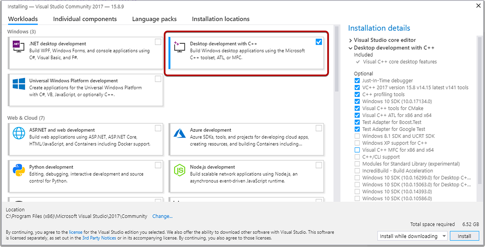
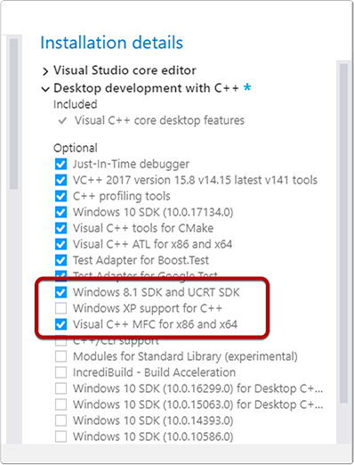
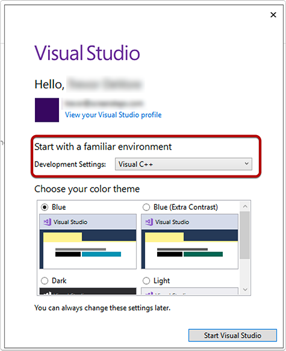
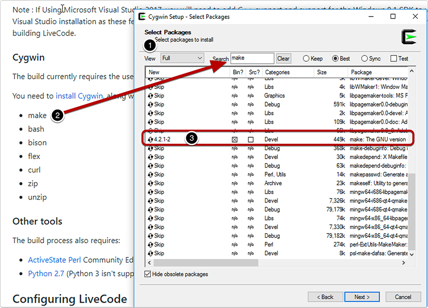
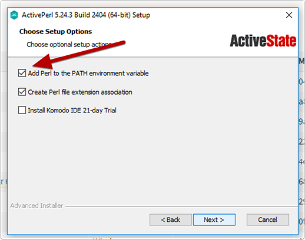
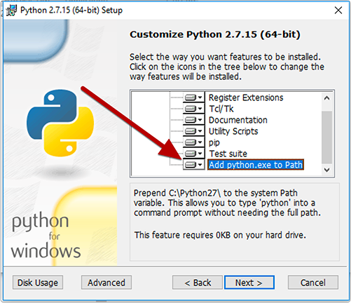
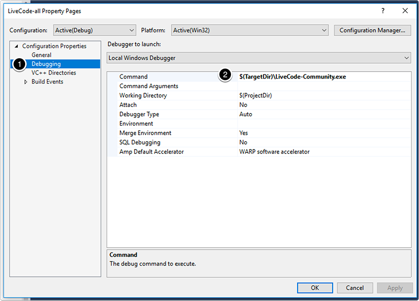
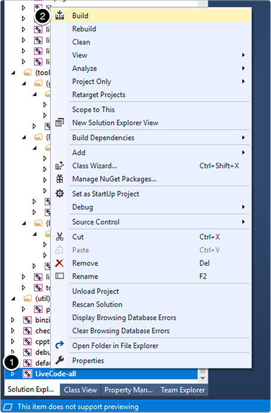

# Compiling for Windows


Copyright © 2015-2019 LiveCode Ltd., Edinburgh, UK

## Dependencies

The Windows build scripts currently don't have any ability to auto-discover tools, so you need to **install all of the build dependencies to their default locations**.

### git

You will need to install [git for Windows](https://git-scm.com/download/win) in order to obtain the source code from GitHub.

### Microsoft Visual Studio

You need a set of Visual Studio build tools and SDKS.  You can use either:

- [Microsoft Visual Studio 2017 Build Tools](https://visualstudio.microsoft.com/downloads/?q=build+tools+2017#other),
  which contains _only_ the compilers and libraries, without any user
  interface; select everything in the installer


- An appropriate edition of the
  [Microsoft Visual Studio 2017](https://visualstudio.microsoft.com/downloads/) IDE

In addition, you should install
[Microsoft Speech SDK 5.1](https://www.microsoft.com/en-gb/download/details.aspx?id=10121)
in order to allow you to compile the `revspeech` external.

Note : If Using Microsoft Visual Studio 2017, you will need to add C++ support and
support for the Windows 8.1 SDK to your Visual Studio installation as these features are currently
not installed by default with Visual Studio 2017 and are necessary for building.

#### Configure for C++ development

Select **Desktop development** with C++ as the install option.



#### Add Windows 8.1 SDK and Visual C++ MFC for x86 and x64



#### Set up for Visual C++

When Visual Studio launches you will be prompted to log in and then decide how you want the environment configured. Select **Visual C++**.



### Cygwin

The build currently requires the use of some tools from the Cygwin distribution of GNU and other open source tools.

You need to [install Cygwin](https://cygwin.com/install.html), along with the following additional packages:

* make
* bash
* bison
* flex
* curl
* zip
* unzip

When you get to the Select Packages screen in the Cygwin installer do the following:

1. Change the View to Full.
2. Search for each additional package listed on the web page.
3. Click on Skip to mark it for installation.


### Other tools

The build process also requires:

* [ActiveState Perl](https://www.activestate.com/activeperl/downloads) Community Edition
* [Python 2.7](https://www.python.org/) (Python 3 isn't supported)

#### Perl install note: Add Perl to the PATH environment variable

The option to add Perl to PATH will be checked by default. Leave it checked.



#### Python install note: Add Python 2.7 to `PATH`

With the Python 2.7 installer you have to customize the installation so that the Python.exe is added to `PATH`. Scroll to the bottom of the list of customizations and activate **Add python.exe to Path**.



## Configuring

Once you have checked out the source code from git, you can run:

````
cmd /C configure.bat
````

(Or just run `configure.bat` by double-clicking on it from Windows Explorer)

This will generate a set of Visual Studio project files in the `build-win-x86/livecode` directory.

### Set the LiveCode-all Debugging Command

In order to debug the IDE you need to configure the Debugging Command for LiveCode-all.

```
$(TargetDir)\LiveCode-Community.exe
```



## Compiling

If you installed the Visual Studio IDE, you can open the
`build-win-x86/livecode/livecode.sln` solution file in Visual Studio,
and build from there.

If you installed the Visual Studio build tools, you can run:

````
cd build-win-x86
set BUILD_PLATFORM=win-x86
cmd /C ..\make.cmd
````

## Build LiveCode-all

Build the LiveCode-all project to compile the engine and run the IDE.


